# 🎨 Pixel Studio

> AI-powered image **and** video generation platform with real-time progress, social features, and a built-in creator economy.

**Pixel Studio** is a full-stack web app where users generate images across many state-of-the-art models (OpenAI `gpt-image-1`, Stable Diffusion 3.5, Flux Pro / Dev / Schnell, Ideogram, FAL, Black Forest, Together, Replicate) and produce short videos via Runway, Luma, and Stability. It ships with collections, a following feed, comments and likes, achievements, a prompt marketplace, creator tipping, print-on-demand, an admin console, and a Tailwind-based design system with a persisted light/dark theme.

Built on **Remix + Vite + React 18 + TypeScript**, backed by **PostgreSQL + Prisma**, with **Upstash QStash** powering the async generation queue and **WebSockets** streaming live progress to the client.

## 📸 Screenshots

A tour of the redesigned UI (PR #150, June 2026). All captures come from the live app — see [`pr-screenshots/`](./pr-screenshots/) for the full historical set.

### Desktop

| Landing                                                        | Explore                                                        |
| -------------------------------------------------------------- | -------------------------------------------------------------- |
| 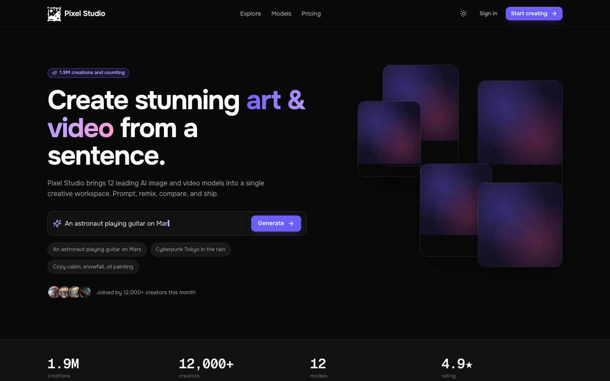 | 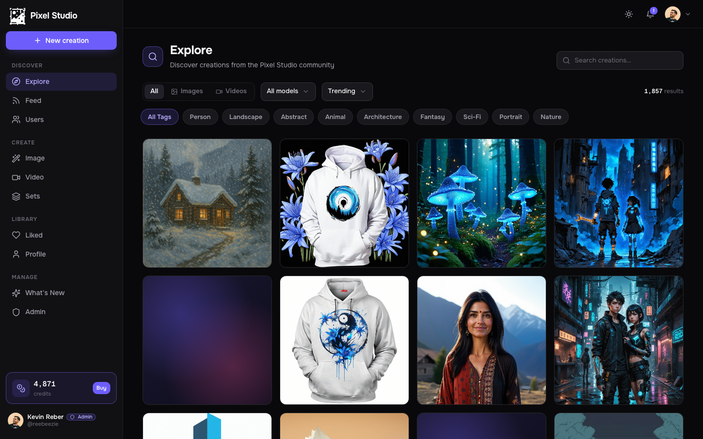 |

| Create — Image                                                      | Create — Video                                                      |
| ------------------------------------------------------------------- | ------------------------------------------------------------------- |
| 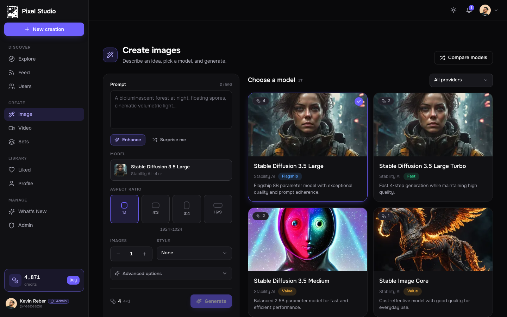 | 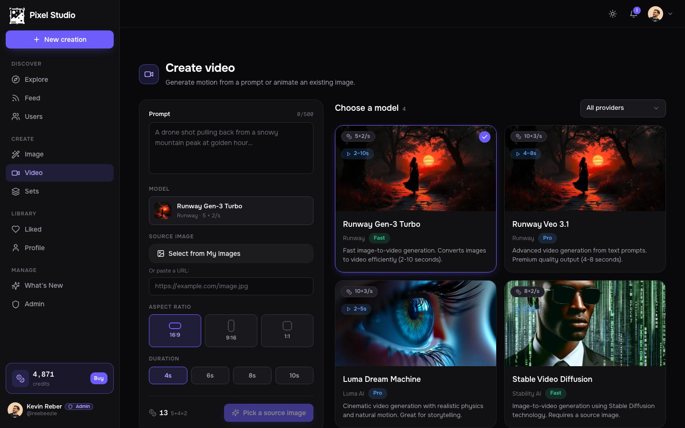 |

| Following Feed                                      | Profile                                                   |
| --------------------------------------------------- | --------------------------------------------------------- |
| 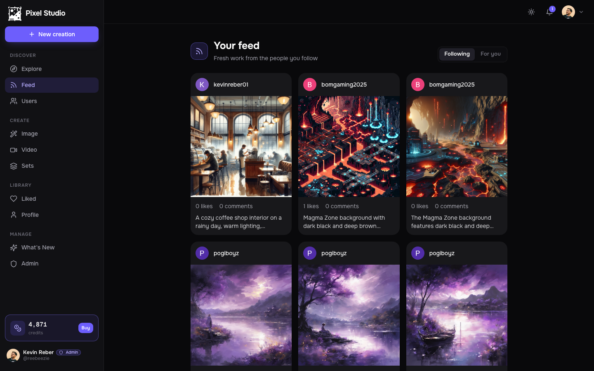 | 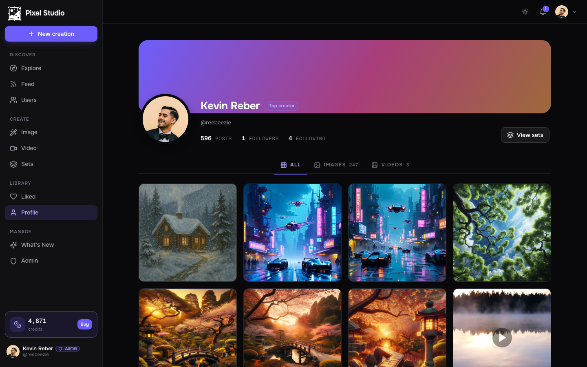 |

| What's New                                                     | Admin Overview                                                          |
| -------------------------------------------------------------- | ----------------------------------------------------------------------- |
| 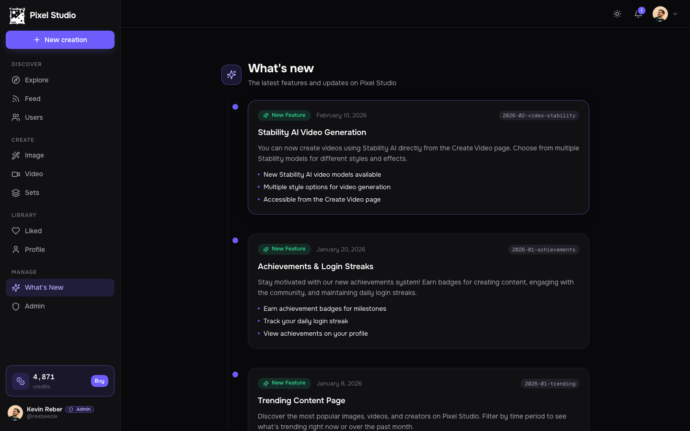 | 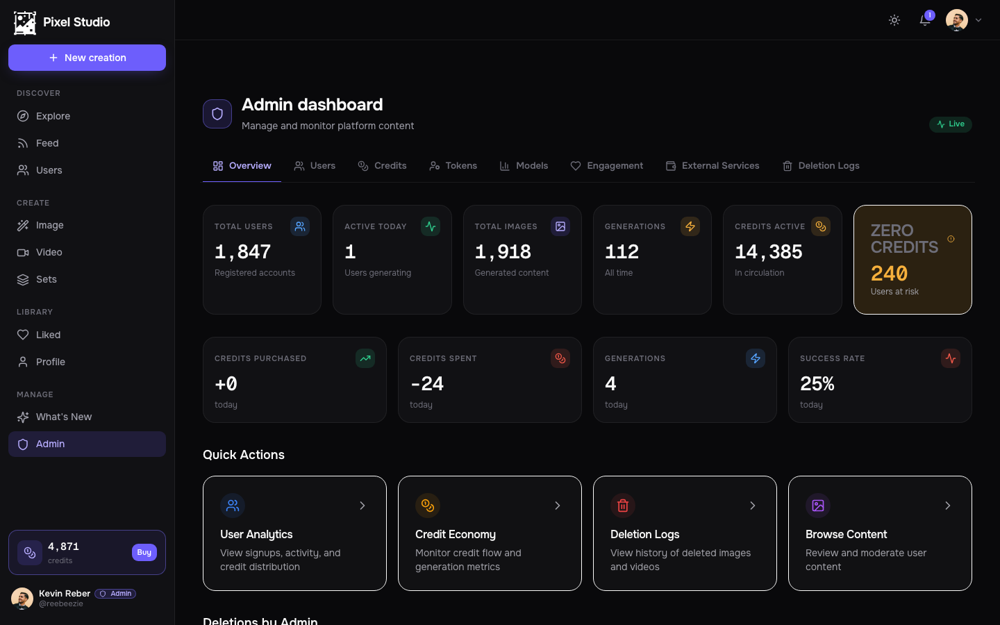 |

### Mobile

<p align="left">
  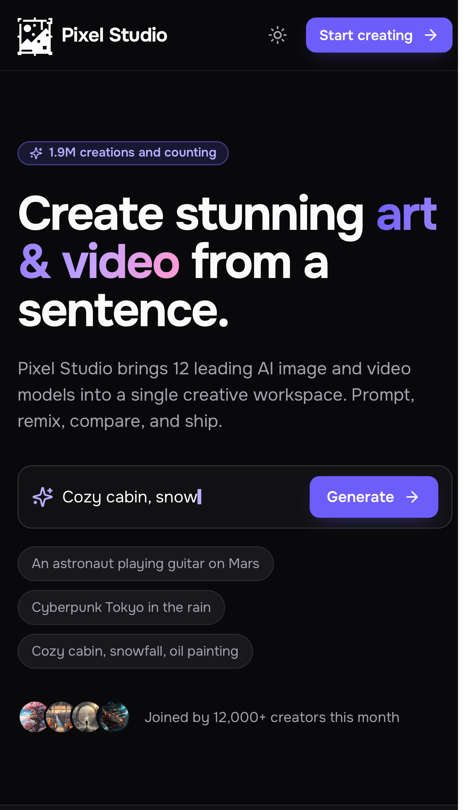
  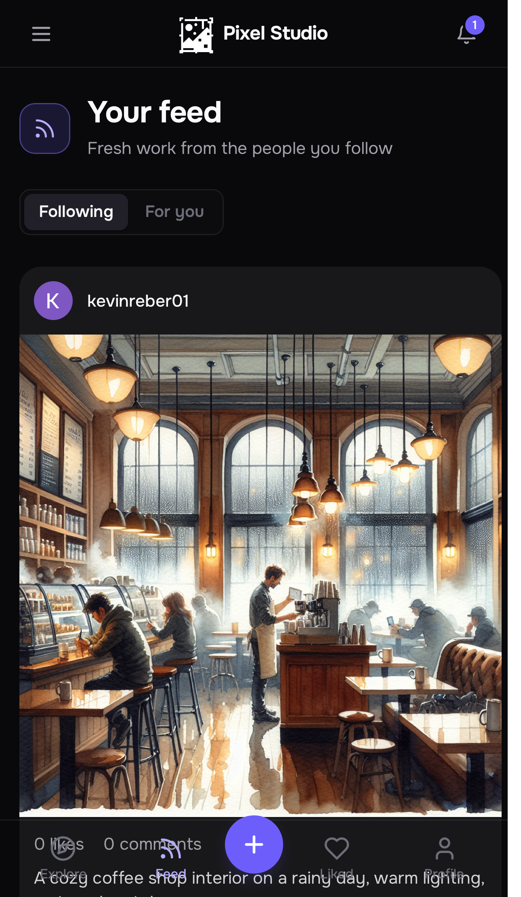
  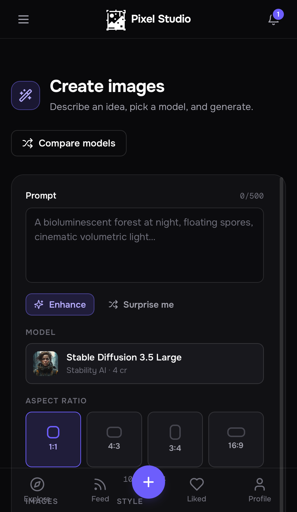
  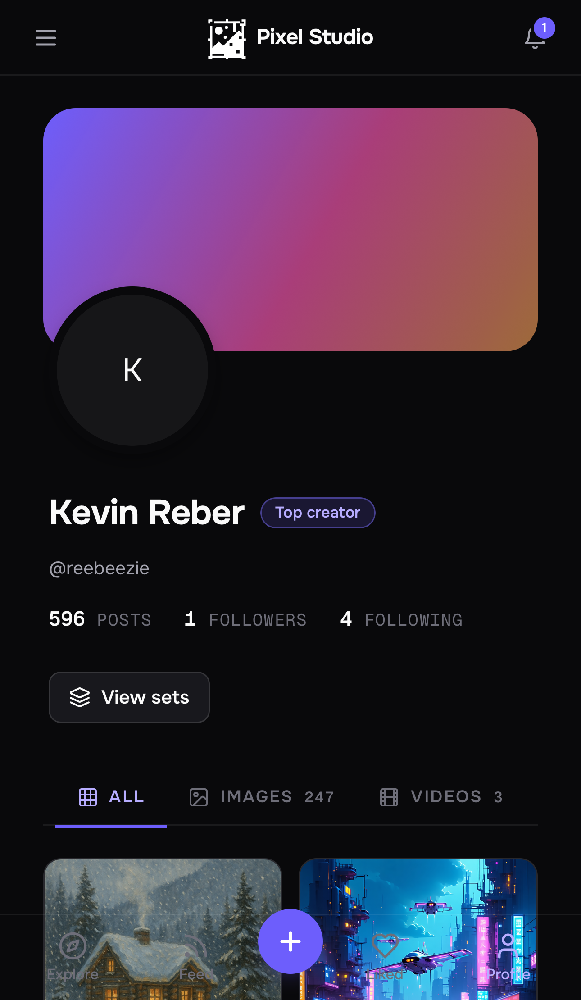
</p>

## ✨ Features

### Generation

- 🖼️ **Images across 8 providers** — OpenAI (`gpt-image-1` with `dall-e-3` fallback), Stable Diffusion 3.5 (Large / Turbo / Medium), Stable Image Core & Ultra, Flux Pro 1.1 / Dev / Schnell, Ideogram, FAL, Black Forest, Replicate, Together
- 🎬 **Video generation** — Runway ML, Luma AI, Stability AI, with automatic thumbnail extraction
- 🔀 **Multi-model comparison** — run one prompt across multiple models and compare the results side-by-side
- 🌱 **Image remixing** — fork any image, track lineage through `Image.parentId`
- ⚡ **Async pipeline** — Upstash QStash queues jobs, workers process them, WebSockets stream live progress to the UI

### Social & community

- 🗂️ **Collections** — public, private, and premium (paid) collections of images
- 👥 **Following feed** — see new work from creators you follow
- 💬 **Comments, likes, replies** — full nested-comment system on images and videos
- 🏆 **Achievements & login streaks** — gamified engagement
- 🛒 **Prompt marketplace** — sell and review high-quality prompts with built-in payouts
- 💰 **Tipping** — send credits directly to other creators
- 🖨️ **Print on demand** — order physical prints of generated images

### Monetization & ops

- 💳 **Stripe-powered credits** with full ledger (`CreditTransaction`)
- 📈 **Analytics dashboards** for users and admins, plus per-prompt performance and "style fingerprint" analysis
- 🛡️ **Admin console** — users, credits, models, external services, tokens, deletion audit logs, engagement, blog management
- 📝 **Blog / tutorials** with SEO metadata
- 🌗 **Light & dark themes** persisted on the `User` record
- 📱 **Mobile-first redesign** — sidebar collapses into a bottom nav + slide-up sheet on small screens

## 🛠️ Tech Stack

| Layer       | Technology                                                                                            |
| ----------- | ----------------------------------------------------------------------------------------------------- |
| Framework   | Remix 2.16 + React 18 + TypeScript 5 + Vite 5                                                         |
| Styling     | TailwindCSS 3, custom design tokens (`app/globals.css`), Radix UI primitives, shadcn/ui, Lucide icons |
| Database    | PostgreSQL + Prisma ORM 5 (43 models)                                                                 |
| Auth        | Remix Auth + Google OAuth; Supabase v2 auth migration in progress                                     |
| State       | Zustand (client) + React Context (generation progress)                                                |
| Queue       | **Upstash QStash** (default) — Apache Kafka pipeline available but on hold                            |
| Cache       | Upstash Redis                                                                                         |
| Storage     | AWS S3                                                                                                |
| Real-time   | Native WebSocket server                                                                               |
| AI (Images) | OpenAI, Hugging Face, FAL, Ideogram, Replicate, Together, Black Forest Labs, Stability                |
| AI (Video)  | Runway ML, Luma AI, Stability AI                                                                      |
| Payments    | Stripe                                                                                                |
| Logging     | Winston + OpenTelemetry (OTLP HTTP)                                                                   |
| Monitoring  | Sentry, Vercel Analytics, PostHog                                                                     |
| Testing     | Vitest 4, Playwright                                                                                  |
| Tooling     | Husky + lint-staged, ESLint (Airbnb-ish), Prettier                                                    |
| Deploy      | Vercel (primary), Express production server (`server.js`)                                             |

## 🚀 Quick Start

### Prerequisites

- **Node.js** ≥ 20
- **PostgreSQL** (local or hosted — Supabase, Neon, RDS, etc.)
- **Upstash** account for Redis + QStash
- API keys for at least one image provider (OpenAI is enough to get started)

> Kafka and Docker are **not** required in the default configuration. QStash handles async generation out of the box.

### 1. Clone & install

```bash
git clone https://github.com/kevinreber/pixel-studio.git
cd pixel-studio
npm install
```

### 2. Configure environment

```bash
cp env.example .env
# Edit .env — see "Environment Variables" below
```

At minimum, fill in `DATABASE_URL`, `SESSION_SECRET`, `GOOGLE_CLIENT_ID/SECRET`, `OPENAI_API_KEY`, `UPSTASH_REDIS_REST_*`, `QSTASH_*`, and the AWS S3 keys.

### 3. Set up the database

```bash
npx prisma generate
npx prisma db push
```

### 4. Run the dev server

```bash
npm run dev
```

The app boots at <http://localhost:5173>. Image jobs flow through QStash and progress updates stream via WebSocket — no extra processes needed.

### (Optional) Stripe webhooks

```bash
npm run stripe:listen
```

### (Optional) Activate the Kafka pipeline

Kafka is fully wired up but parked to save infrastructure cost. To turn it on, set `QUEUE_BACKEND=kafka` and the `KAFKA_*` vars in `.env`, then run:

```bash
docker-compose -f infrastructure/kafka/docker-compose.kafka.yml up -d
npm run kafka:create-topics
npm run kafka:consumer       # workers
npm run kafka:websocket      # progress stream
```

## 📋 Environment Variables

See [`env.example`](./env.example) for the full annotated template. The required groups are:

```env
# Database
DATABASE_URL=
DIRECT_URL=

# Auth
SESSION_SECRET=
GOOGLE_CLIENT_ID=
GOOGLE_CLIENT_SECRET=
SUPABASE_URL=
SUPABASE_ANON_KEY=

# Image providers (at least one)
OPENAI_API_KEY=
HUGGINGFACE_API_KEY=
FAL_KEY=
REPLICATE_API_TOKEN=
IDEOGRAM_API_KEY=
TOGETHER_API_KEY=
BFL_API_KEY=

# Video providers
RUNWAY_API_KEY=
LUMAAI_API_KEY=
STABILITY_API_KEY=

# Cache & queue
UPSTASH_REDIS_REST_URL=
UPSTASH_REDIS_REST_TOKEN=
QSTASH_TOKEN=
QSTASH_CURRENT_SIGNING_KEY=
QSTASH_NEXT_SIGNING_KEY=
QUEUE_BACKEND=qstash         # "qstash" (default) or "kafka"

# Storage
AWS_ACCESS_KEY_ID=
AWS_SECRET_ACCESS_KEY=
AWS_REGION=us-east-1
S3_BUCKET_NAME=

# Payments
STRIPE_PUBLIC_KEY=
STRIPE_SECRET_KEY=
STRIPE_WEBHOOK_SECRET=

# Monitoring (optional but recommended)
SENTRY_ORG=
SENTRY_PROJECT=
SENTRY_AUTH_TOKEN=
```

## 📖 Available Scripts

### Development

```bash
npm run dev              # Vite dev server (http://localhost:5173)
npm run build            # Production build (remix vite:build)
npm run start            # Start production server (remix-serve)
npm run typecheck        # TypeScript checks
npm run lint             # ESLint
```

### Testing

```bash
npm run test             # Vitest watch mode
npm run test:run         # Vitest single run
npm run test:coverage    # Vitest with v8 coverage
npm run test:e2e         # Playwright E2E suite
npm run test:e2e:ui      # Playwright UI mode
```

### Database

```bash
npx prisma studio        # Visual DB browser
npx prisma db push       # Push schema
npx prisma generate      # Generate client
npx prisma migrate dev   # Create migration
```

### Kafka (only if `QUEUE_BACKEND=kafka`)

```bash
npm run kafka:create-topics
npm run kafka:consumer
npm run kafka:websocket
npm run kafka:health
npm run kafka:monitor
```

### Utilities

```bash
npm run stripe:listen              # Stripe webhook forwarding → localhost:5173/webhook
npm run video:backfill-thumbnails  # Backfill thumbnails for existing videos
```

## 🏗️ Architecture

### Async generation flow (QStash, default)

```mermaid
graph TD
    A[Create form] --> B[Remix action]
    B --> C[QStash publish]
    C --> D[/api/queue/process-image]
    D --> E[Provider SDK call]
    E --> F[S3 upload]
    F --> G[Postgres update]
    G --> H[WebSocket broadcast]
    H --> I[Live UI progress]
    I --> J[Redirect to results]
```

### Project structure

```
pixel-studio/
├── app/
│   ├── components/              # 55 UI components (incl. shadcn primitives + ps/* design system)
│   ├── config/                  # Models, pricing, breakpoints, build logs
│   ├── contexts/                # Generation progress context
│   ├── hooks/                   # Custom React hooks
│   ├── pages/                   # Page-level components
│   ├── routes/                  # 96 Remix routes (pages + 47 API endpoints)
│   ├── schemas/                 # Zod validation
│   ├── server/                  # Server-only utilities (74 files)
│   ├── services/                # Business logic (35 files)
│   ├── utils/                   # Shared utilities
│   └── client/                  # Client-only utilities
├── infrastructure/kafka/        # Optional Kafka deployment (Docker, AWS MSK)
├── prisma/                      # Schema (43 models) + migrations
├── scripts/                     # Background workers + maintenance scripts
├── tests/                       # Playwright E2E suite
├── docs/images/screenshots/     # README screenshots
└── pr-screenshots/              # Historical UI snapshots
```

## 🔄 Processing Modes

The app supports three queue back-ends, toggled via `QUEUE_BACKEND`:

| Mode                     | Setting                                                 | When to use                                                                                                                      |
| ------------------------ | ------------------------------------------------------- | -------------------------------------------------------------------------------------------------------------------------------- |
| **QStash** (default)     | `QUEUE_BACKEND=qstash`                                  | Production and local dev. Zero-ops async pipeline with retries + signed webhooks. Local dev simulates QStash without an account. |
| **Kafka** (on hold)      | `QUEUE_BACKEND=kafka` + `KAFKA_*` vars                  | High-throughput scale-out. Requires the Kafka consumers and WebSocket workers to be running.                                     |
| **Synchronous** (legacy) | `ENABLE_KAFKA_IMAGE_GENERATION=false`, no QStash config | Debugging only — blocks the request until the model finishes.                                                                    |

Multi-model comparison is supported in both async modes via the `ComparisonRequest` / `ComparisonGeneration` models.

## 🧪 Testing

- **Unit tests (Vitest 4)** — colocated as `*.test.ts(x)`. 21+ files across server, services, utils, components, contexts. Run with `npm run test`.
- **E2E (Playwright)** — in [`tests/`](./tests/), 12 specs covering pages, create flows, notifications, streaks, admin audit, sets, video, and the progress toaster. Run with `npm run test:e2e`.
- **Coverage** — `npm run test:coverage` (v8 reporter).

## 📚 Documentation

| Document                                                                   | Purpose                                |
| -------------------------------------------------------------------------- | -------------------------------------- |
| [`ARCHITECTURE.md`](./ARCHITECTURE.md)                                     | High-level system architecture         |
| [`TECHNICAL_IMPLEMENTATION_GUIDE.md`](./TECHNICAL_IMPLEMENTATION_GUIDE.md) | Deep dive into how things are wired up |
| [`API.md`](./API.md)                                                       | API endpoint reference                 |
| [`DEVELOPMENT.md`](./DEVELOPMENT.md)                                       | Local dev setup                        |
| [`TESTING.md`](./TESTING.md)                                               | Testing guide                          |
| [`CACHING_STRATEGY.md`](./CACHING_STRATEGY.md)                             | Redis caching strategy                 |
| [`KAFKA_ENVIRONMENT_SETUP.md`](./KAFKA_ENVIRONMENT_SETUP.md)               | Kafka config (when re-enabling)        |
| [`infrastructure/kafka/README.md`](./infrastructure/kafka/README.md)       | Kafka deployment details               |
| [`CHANGELOG.md`](./CHANGELOG.md)                                           | Version history                        |
| [`BUGFIXES.md`](./BUGFIXES.md)                                             | Bug-fix log with root-cause notes      |
| [`CONTRIBUTING.md`](./CONTRIBUTING.md)                                     | Contribution guidelines                |
| [`IMPROVEMENT_STRATEGY.md`](./IMPROVEMENT_STRATEGY.md)                     | Roadmap                                |
| [`REDESIGN_FOLLOWUPS.md`](./REDESIGN_FOLLOWUPS.md)                         | Outstanding tasks from PR #150         |

## 🤝 Contributing

1. Fork the repo
2. Create a feature branch: `git checkout -b feat/short-description`
3. `npm install` and configure `.env`
4. Make your change. **Run the pre-commit gate**:
   ```bash
   npm run lint && npm run typecheck && npm run test:run && npm run build
   ```
5. Add an entry to [`CHANGELOG.md`](./CHANGELOG.md). If you fixed a notable bug, add a root-cause note to [`BUGFIXES.md`](./BUGFIXES.md).
6. Open a PR. Husky + lint-staged will keep your commits clean automatically.

See [`CONTRIBUTING.md`](./CONTRIBUTING.md) for the long form.

## 🐛 Troubleshooting

**Database connection errors**

```bash
echo $DATABASE_URL
npx prisma db push   # also validates the connection
```

**QStash jobs not firing locally**

- Confirm `QSTASH_TOKEN` and both signing keys are set.
- Watch the dev server logs for `[qstash]` lines — local dev simulates QStash when keys are absent.

**WebSocket connection failures (Kafka mode)**

```bash
curl -I http://localhost:3001/health
lsof -i :3001
```

**Image generation errors**

- Verify the provider API key for the model you selected (`OPENAI_API_KEY`, `FAL_KEY`, etc.).
- Check S3 permissions for `S3_BUCKET_NAME`.
- Look at the request in `GenerationLog` for the failure reason.

## 🚀 Deployment

Pixel Studio is deployed primarily to **Vercel** using the `@vercel/remix` preset. The Express server (`server.js`) is available for non-Vercel hosts.

### Vercel (recommended)

```bash
npm i -g vercel
vercel
```

In the Vercel dashboard:

- Add every variable from your `.env` (see `env.example`).
- Keep `QUEUE_BACKEND=qstash` — QStash works natively on serverless without long-running workers.

### Self-hosted / VPS

Use `server.js` as the entry point (`node server.js`) with PM2 or systemd. If you turn Kafka back on, run `scripts/startConsumers.ts` and `scripts/startWebSocketServer.ts` as separate services.

### Pre-deploy checklist

- [ ] All required env vars present in the target environment
- [ ] `DATABASE_URL` reachable from the deploy host
- [ ] S3 bucket exists and credentials have `PutObject` / `GetObject` permissions
- [ ] Stripe webhook secret matches the configured endpoint
- [ ] QStash signing keys match the dashboard
- [ ] Sentry DSN configured if you want error tracking

## 📄 License

MIT — see [`LICENSE`](./LICENSE).

## 🙏 Acknowledgments

[Remix](https://remix.run) · [OpenAI](https://openai.com) · [Hugging Face](https://huggingface.co) · [Stability AI](https://stability.ai) · [Runway](https://runwayml.com) · [Luma](https://lumalabs.ai) · [Tailwind CSS](https://tailwindcss.com) · [Prisma](https://prisma.io) · [Radix UI](https://www.radix-ui.com) · [Upstash](https://upstash.com) · [Vercel](https://vercel.com)

---

**Built with ❤️ by Kevin Reber**
